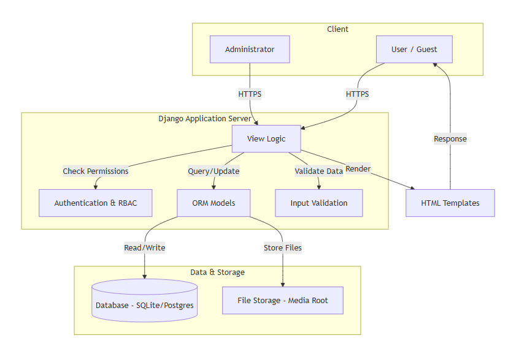
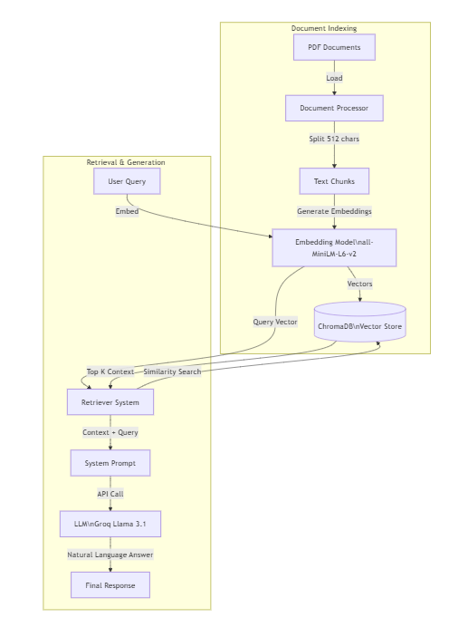

## DocuVault - Document Management System with RAG Chatbot

### 📖 Project Overview

**DocuVault** is a comprehensive Django-based Document Management System (DMS) designed for secure, efficient, and intelligent document handling. It features role-based access control, version tracking, robust collaboration tools, and a state-of-the-art **AI-powered RAG (Retrieval-Augmented Generation) chatbot** that allows users to query their documents in natural language.

---

### 🚀 Features

#### 🤖 AI-Powered RAG Chatbot
The system integrates a sophisticated RAG pipeline to provide intelligent document interaction:
- **Intelligent Document Search**: Ask questions about your documents in natural language.
- **Context-Aware Responses**: Utilizes the **Qwen2.5-7B** Large Language Model (LLM) for high-quality, accurate answers.
- **Source Citations**: Transparently provides citations, showing exactly which document pages were used to generate the answer.
- **Conversation Memory**: Maintains context across multi-turn conversations for natural follow-up questions.
- **Document Indexing**: Automatic vectorization of PDF documents using **Qwen3-Embedding-0.6B**.
- **GPU Acceleration**: Fully supports CUDA for fast inference on supported hardware.
- **Permission-Aware**: Respects document access levels; users can only query documents they are authorized to view.
- **Hallucination Prevention**: Strictly adheres to the provided context to minimize false information.

#### 👥 User Management & Authentication
- **Guest Users**: Limited access to view public documents and register accounts.
- **Regular Users**: Full document management capabilities for their own files.
- **Admin Users**: Complete system administration and oversight.
- **Role-Based Access Control (RBAC)**: Granular permission system with custom roles and hierarchical levels (1-100).
- **Secure Authentication**: Robust login and registration system.
- **User Profiles**: Rich profiles with avatars, bios, and activity history.

#### 📄 Document Management
- **Upload & Storage**: Securely upload and store documents with support for various file types.
- **Access Control Levels**:
  - **Public**: Accessible to all users.
  - **Private**: Restricted to the owner.
  - **Role-Based**: Accessible to users with a specific role level or higher.
  - **Custom**: Shared with specific individual users.
- **Version Control**: comprehensive history of document versions with change notes.
- **Metadata Tracking**:
  - Title, description, category, and tags.
  - File size, type, view counts, and download counts.
- **Document Locking**: Prevents concurrent edits to ensure data integrity.
- **Soft Delete**: Safety mechanism to recover accidentally deleted documents.

#### 🔍 Search & Discovery
- **Advanced Search**: Full-text search capabilities with powerful filters.
- **Organization**:
  - **Categories**: Hierarchical system with color-coding and icons.
  - **Tags**: Flexible tagging for cross-category organization.
- **Filtering & Sorting**: Filter by owner, date, access level; sort by views, title, date, etc.

#### 🤝 Collaboration
- **Comments & Replies**: Threaded discussions directly on documents.
- **Sharing**:
  - Direct sharing with specific users.
  - **Shareable Links**: Generate temporary, secure links with password protection, expiration dates, and access limits.
- **Notifications**: Real-time alerts for shares, comments, mentions, and permission changes.

#### 🛠️ Additional Tools
- **Favorites/Bookmarks**: Quick access to frequently used documents.
- **Activity Logging**: Detailed audit trail of all user actions.
- **Dashboard**: Personalized overview of recent activity and stats.
- **Bulk Operations**: Upload multiple documents simultaneously.
- **File Preview**: View documents before downloading.

---

### 🏗️ System Architecture

#### DMS Architecture Diagram


#### Project Structure
```
DocuVault/
├── config/                 # Django project settings (settings, urls, wsgi)
├── documents/              # Main Django app
│   ├── models.py           # Database models
│   ├── views.py            # View functions
│   ├── rag_views.py        # RAG chatbot views
│   ├── urls.py             # URL routing
│   ├── forms.py            # Form definitions
│   ├── admin.py            # Admin interface
│   ├── rag/                # RAG system modules (See RAG Architecture below)
│   ├── templates/          # HTML templates
│   └── migrations/         # Database migrations
├── media/                  # User uploaded files
│   ├── documents/          # Document files
│   ├── avatars/            # User avatars
│   └── rag/                # RAG data (Vector DB)
├── static/                 # Static files (CSS, JS)
├── fix_dependencies.py     # Automated installer
├── test_rag.py             # RAG testing script
└── manage.py               # Django management
```

#### RAG Module Architecture
The RAG system is modular and self-contained within `documents/rag/`:
```
documents/rag/
├── __init__.py              # Module exports
├── config.py                # Central configuration (RAGConfig)
├── document_processor.py    # PDF loading and chunking (DocumentProcessor)
├── embeddings.py            # Embedding generation (EmbeddingManager)
├── vector_store.py          # ChromaDB vector database (VectorStore)
├── llm_manager.py           # LLM loading and inference (LLMManager)
├── retriever.py             # Query processing and retrieval (Retriever)
└── conversation.py          # Chatbot with memory (RAGChatbot)
```

---

### 🔧 Technical Details

#### Technology Stack
- **Backend**: Django 4.2.26
- **Database**: SQLite (default) / PostgreSQL (production ready)
- **Frontend**: HTML, Vanilla CSS, JavaScript
- **AI/ML Frameworks**:
  - **LangChain** 0.1.20
  - **Transformers** (HuggingFace)
  - **Sentence-Transformers**
  - **PyTorch** (with CUDA support)
- **Vector Database**: ChromaDB (Persistent storage)

#### RAG Components & Models
The RAG system is built on high-performance open source models and cloud-based inference:

1.  **Large Language Model (LLM)**:
    -   **Model**: `llama-3.1-8b-instant` (via Groq)
    -   **Provider**: Groq API
    -   **Role**: Generates natural language answers based on retrieved context with ultra-low latency.
    -   **Note**: Requires a `GROQ_API_KEY` environment variable.

2.  **Embeddings**:
    -   **Model**: `all-MiniLM-L6-v2`
    -   **Library**: Sentence-Transformers
    -   **Role**: Converts text into semantic vector representations for similarity search.
    -   **Performance**: Fast and efficient model optimized for semantic search tasks.

3.  **Vector Store**:
    -   **Technology**: ChromaDB
    -   **Role**: Stores document embeddings and metadata for fast retrieval.

4.  **Configuration (`config.py`)**:
    -   **Chunk Size**: 512 characters
    -   **Chunk Overlap**: 100 characters
    -   **Similarity Threshold**: 0.15
    -   **Max New Tokens**: 512

#### RAG Workflow

#### RAG Flowchart


1.  **Ingestion**: PDFs are loaded via `DocumentProcessor`.
2.  **Chunking**: Text is split into overlapping chunks (512 chars).
3.  **Embedding**: `EmbeddingManager` converts chunks to vectors using `all-MiniLM-L6-v2`.
4.  **Storage**: Vectors are stored in `VectorStore` (ChromaDB).
5.  **Retrieval**: User query is embedded; `Retriever` fetches relevant chunks.
6.  **Generation**: `LLMManager` sends the query + context to Groq's `llama-3.1-8b-instant` for response generation.
7.  **Memory**: `RAGChatbot` manages conversation history for context.

---

### 🗄️ Database Models

#### Core Models
1.  **User** (Extended AbstractUser): Custom user model with role, bio, avatar, and department.
2.  **Role**: Hierarchical roles (levels 1-100) for RBAC.
3.  **Document**: Central model for files, including access levels, versioning, and counters.
4.  **Category**: Hierarchical organization with colors and icons.
5.  **Tag**: Many-to-many tagging system.

#### Supporting Models
6.  **DocumentVersion**: Tracks history of document changes.
7.  **DocumentComment**: Threaded comments on documents.
8.  **SharedLink**: Manages temporary, secure sharing links.
9.  **Favorite**: User bookmarks.
10. **ActivityLog**: Comprehensive audit trail.
11. **Notification**: User alerts system.

#### RAG System Models
12. **ChatSession**: Manages user chatbot sessions.
13. **ChatMessage**: Stores individual messages and their source citations.
14. **DocumentEmbedding**: Tracks indexing status and metadata for RAG.

---

### 🔐 Permission & Security

#### Access Levels
-   **Public**: Open to all.
-   **Private**: Owner only.
-   **Role-Based**: Restricted by role hierarchy (e.g., Level 30+).
-   **Custom**: Explicitly granted to specific users.

#### Security Features
-   **Authentication**: Django's secure password hashing and session management.
-   **CSRF Protection**: Enabled on all forms.
-   **Input Validation**: Strict file upload validation (size/type) and XSS protection.
-   **SQL Injection**: Prevented via Django ORM.
-   **Audit Logging**: All sensitive actions are logged.

---

### 🛣️ URL Structure

-   **Auth**: `/register/`, `/login/`, `/logout/`
-   **Core**: `/` (Home), `/dashboard/`
-   **Documents**: `/documents/`, `/documents/create/`, `/documents/<id>/` (view/edit/delete/download)
-   **RAG Chatbot**: `/chatbot/`
-   **Collaboration**: `/documents/<id>/comments/create/`, `/documents/<id>/share/`
-   **Admin**: `/admin/users/`, `/admin/roles/`
-   **Profile**: `/profile/`, `/profile/edit/`

---

### 🔧 Installation & Setup

#### Prerequisites
-   **Python**: 3.10+
-   **RAM**: 8GB+ (16GB recommended for RAG).
-   **Groq API Key**: Required for the chatbot functionality.
-   **Storage**: ~5GB free space (mostly for dependencies and vector DB).

#### Quick Start
1.  **Clone Repository**:
    ```bash
    git clone https://github.com/ft-prince/DocuVault.git
    cd DocuVault
    ```

2.  **Environment Setup**:
    ```bash
    pip install uv

    uv venv
    # Windows
    venv\Scripts\activate
    # Linux/Mac
    source venv/bin/activate

    uv sync
    ```

3.  **Install Dependencies**:
    ```bash
    # Automated
    python fix_dependencies.py
    
    # OR Manual
    pip install -r requirements.txt
    pip install -r requirements_rag.txt

    # OR just use uv
    uv sync
    ```

4.  **Set Environment Variables**:
    Create a `.env` file in the project root and add your Groq API key:
    ```
    GROQ_API_KEY=your_api_key_here
    ```

5.  **Database Migration**:
    ```bash
    python manage.py migrate
    ```

6.  **Create Admin**:
    ```bash
    python manage.py createsuperuser
    ```

7.  **Run Server**:
    ```bash
    python manage.py runserver
    ```
    -   App: http://127.0.0.1:8000/
    -   Admin: http://127.0.0.1:8000/admin/
    -   Chatbot: http://127.0.0.1:8000/chatbot/

#### Windows Automated Setup
Use the provided scripts for a one-click setup:
-   PowerShell: `.\setup_windows.ps1`
-   CMD: `setup_windows.bat`

#### RAG Model Setup
The system uses `all-MiniLM-L6-v2` for embeddings, which will be downloaded automatically on the first run (~80MB). The LLM is accessed via the Groq API, so no large local model download is required.


---

### 📝 Usage Examples

#### RAG Chatbot
```python
from documents.rag import RAGChatbot, RAGConfig
from documents.rag.document_processor import DocumentProcessor

# Initialize
config = RAGConfig()
chatbot = RAGChatbot(config=config)
chatbot.initialize()

# Index Documents
processor = DocumentProcessor(config=config)
docs = processor.load_documents_from_directory('./my_docs')
chatbot.index_documents(docs)

# Query
answer, sources = chatbot.query("What is the project timeline?")
print(answer)
```

#### Document Management (Code)
```python
# Create a restricted document
doc = Document.objects.create(
    title='Confidential Report',
    file='report.pdf',
    owner=user,
    access_level='role',
    required_role_level=50  # Only for senior roles
)

# Check permissions
if doc.can_view(user):
    print("Access Granted")
```

---

#### ⚙️ Configuration Options (RAG)

Modify `documents/rag/config.py` to tune performance:

| Parameter | Default | Description |
|-----------|---------|-------------|
| `CHUNK_SIZE` | 512 | Characters per chunk. |
| `CHUNK_OVERLAP` | 100 | Overlap between chunks to preserve context. |
| `N_RESULTS` | 6 | Number of chunks to retrieve per query. |
| `SIMILARITY_THRESHOLD` | 0.15 | Minimum relevance score for retrieval. |
| `MAX_NEW_TOKENS` | 512 | Maximum length of the LLM response. |
| `TEMPERATURE` | 0.2 | Creativity of the response (0.0-1.0). |

---

### 🚦 Future Enhancements

-   [ ] **Multi-language Support**: Expand RAG capabilities to non-English documents.
-   [ ] **Document Summarization**: Auto-generate summaries upon upload.
-   [ ] **Async Indexing**: Use Celery for background document processing.
-   [ ] **Real-time Collaboration**: WebSocket integration for live editing/viewing.
-   [ ] **Cloud Storage**: AWS S3 / Google Drive integration.
-   [ ] **Hybrid Search**: Combine keyword search with semantic search.
-   [ ] **Multi-modal Support**: RAG support for images and tables within PDFs.

---

### � Project Implementation Timeline

The project development is structured into distinct phases to ensure a robust and scalable delivery.

| Phase | Description | Date | Key Deliverables | Phase Status |
| :--- | :--- | :--- | :--- | :--- |
| **Phase 1** | **Planning & Architecture** | Oct 01 - Oct 14, 2025 | • ✅ Requirement Analysis<br>• ✅ Database Schema Design<br>• ✅ Technology Stack Selection<br>• ✅ UI/UX Wireframes | ✅ Completed |
| **Phase 2** | **Core DMS Development** | Oct 15 - Nov 11, 2025 | • ✅ User Authentication & RBAC<br>• ✅ Document CRUD Operations<br>• ✅ File Upload & Storage System<br>• ✅ Basic Search Functionality | ✅ Completed |
| **Phase 3** | **RAG System Integration** | Nov 12 - Nov 30, 2025 | • ✅ PDF Processing & Chunking Pipeline<br>• ✅ Vector Database (ChromaDB) Setup<br>• ✅ LLM Integration (Groq)<br>• ✅ Chatbot Interface Implementation | ✅ Completed |
| **Phase 4** | **Advanced Features & UI** | Dec 01 - Dec 14, 2025 | • 🔄 Advanced Search & Filtering<br>• 🔄 Collaboration Tools (Comments, Sharing)<br>• ⏳ Dashboard & Analytics<br>• 🔄 Frontend Styling & Responsiveness | 🔄 In Progress |
| **Phase 5** | **Testing & Optimization** | Dec 15 - Dec 21, 2025 | • ⏳ Unit & Integration Testing<br>• ⏳ Performance Tuning (RAG Latency)<br>• ⏳ Security Audits<br>• ⏳ User Acceptance Testing (UAT) | ⏳ Pending |
| **Phase 6** | **Deployment & Handover** | Dec 22 - Dec 28, 2025 | • ⏳ Production Environment Setup<br>• ⏳ CI/CD Pipeline Configuration<br>• ⏳ Final Documentation<br>• ⏳ Project Handover | ⏳ Pending |

---

### �📄 License
This project is open source and available for educational and commercial use.

### 👥 Contributing
Contributions are welcome! Please submit a Pull Request.
